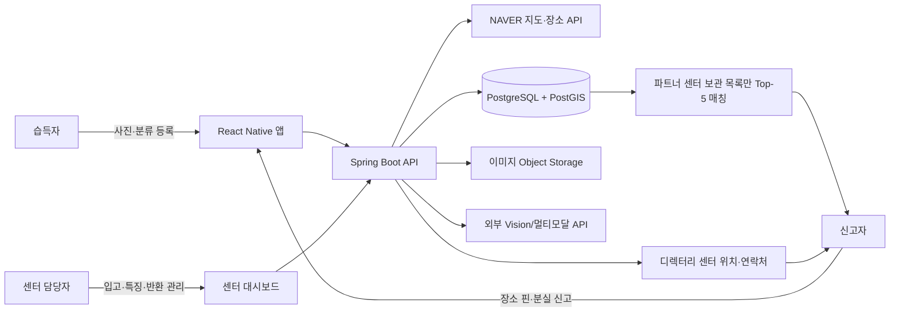
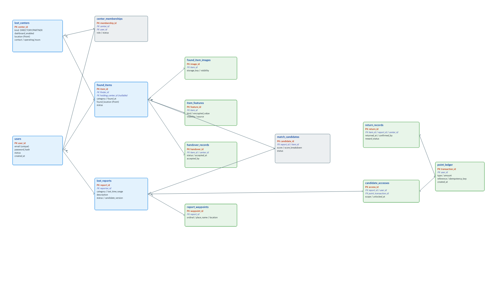

# LOSTORY 통합 서비스 기획서

문서 상태: Current  
최종 갱신일: 2026-08-04  
기준 문서: `NEW_PLAN_CHANGES.md`, `PREVIOUS_PLAN.md`, `PREVIOUS_PLAN_DETAIL.md`

> 이 문서는 변경 기획을 반영해 기존 기획을 다시 구성한 현재 기준 문서다. 기존 문서에 있던 **행사 계정·행사 단위 기능은 전면 제외**한다.

## 1. 서비스 개요

### 1.1 한 줄 정의

LOSTORY는 습득자가 인근 분실물 센터에 물건을 안전하게 인계하도록 돕는 분실물 연결 플랫폼이다. 신고자는 기억나는 장소 핀으로 주변 센터를 찾고 LOSTORY 대시보드를 쓰는 센터의 보관 물품에는 안전한 Top-5 후보 매칭을 제공한다.

### 1.2 해결 범위와 서비스 원칙

LOSTORY는 LOST112 등 공식 유실물 체계를 대체하지 않으며 소유자를 자동 판정하지도 않는다. 서비스는 분실물 센터를 찾고 센터 보관 목록에서 후보를 좁히며 인계·반환 이력을 관리한다. 실제 소유 확인과 반환 결정은 물건을 보관한 분실물 센터가 맡는다.

| 구분 | LOSTORY가 하는 일 | LOSTORY가 하지 않는 일 |
|---|---|---|
| 센터 탐색 | 신고자가 지정한 장소 핀 주변의 분실물 센터 이름·위치·연락처를 제공 | 모든 외부 센터의 보관 목록을 수집하거나 최신성을 보장 |
| 후보 매칭 | 대시보드 도입 센터의 보관 물품에서만 최대 5개를 점수순으로 제시 | 후보가 실제 소유자의 물건이라고 확정 |
| 반환 | 센터의 인계·반환 상태와 포인트 지급 조건을 기록 | 비도입 센터의 오프라인 인계·반환을 자동 확인 |
| 정보 공개 | 점수 우선, 포인트 사용 후 제한된 후보 정보 공개 | 원본 사진·세부 식별 특징·민감 내용물을 공개 |

### 1.3 서비스 모델

LOSTORY는 두 가지 방식으로 운영된다.

1. **공개 센터 디렉터리**: LOSTORY 대시보드를 쓰지 않는 센터도 위치와 연락처만 등록해 신고자에게 안내한다. 이 경로는 센터의 시스템 도입을 전제하지 않는다.
2. **B2B 분실물 관리 대시보드**: 센터가 대시보드를 도입하면 입고·보관·반환 업무를 관리하고 해당 센터의 현재 보관 물품만 LOSTORY 후보 매칭 풀에 연결한다.

이 구조에서는 센터 도입률이 낮아도 신고자가 갈 곳을 찾을 수 있다. 도입 센터에는 업무 자동화와 매칭 유입이라는 분명한 가치가 생긴다.

## 2. 주요 용어 및 서비스 전제사항

### 2.1 용어 정의

| 용어 | 정의 |
|---|---|
| **습득자** | 물건을 발견하고 LOSTORY에 사진과 물품 분류를 등록한 뒤, 인근 분실물 센터에 직접 인계하는 회원. |
| **습득물** | 습득자가 등록했거나 센터에 실제로 입고된 물건. 인계 전 사전 등록과 센터 보관 레코드는 같은 물건의 이력으로 이어질 수 있다. |
| **신고자** | 물건을 잃어버린 뒤 분실 신고를 작성해 후보나 센터 정보를 확인하는 회원. |
| **분실 신고** | 신고자가 물품 분류, 분실 추정 시각, 설명, 하나 이상의 장소 핀을 제출해 만든 검색 요청 레코드. |
| **장소 핀(waypoint)** | 신고자가 기억나는 건물·상점·역·장소를 지도에서 선택한 좌표. 실제 이동 경로 전체는 저장하지 않고 사용자가 선택한 점만 저장한다. |
| **경로 근사 검색** | 단일 장소를 기억하면 핀 1개를, 이동 중 기억나는 지점이 여러 개면 복수 핀을 사용해 각 핀 반경 안의 센터를 합집합으로 찾는 방식. 지도에 선을 그리거나 기기 이동 이력은 수집하지 않는다. |
| **분실물 센터** | 분실물을 보관·반환하는 학교, 도서관, 시설 안내데스크, 기관 등의 주체. `디렉터리 센터`와 `파트너 센터`로 나눈다. |
| **디렉터리 센터** | 위치·연락처 정보만 제공하는 외부 센터. LOSTORY는 이 센터의 재고를 알 수 없어 후보 매칭 대상으로 삼지 않는다. |
| **파트너 센터** | LOSTORY B2B 대시보드로 보관 물품을 관리하는 센터. 현재 보관 중인 습득물만 후보 매칭 대상으로 삼는다. |
| **센터 담당자** | 파트너 센터에 소속되어 입고 처리, 특징 보완, 상태 변경, 소유 확인, 반환을 맡는 회원. |
| **후보** | 특정 분실 신고와 유사해 시스템이 반환한 파트너 센터 보관 습득물. 최대 5개를 제공하며 소유권 증거는 아니다. |
| **매칭 점수** | 경로 근사 위치, 시간, 물품 분류, 색상, 공개 설명·추출 특징의 유사도를 0~100으로 정규화한 후보 순위 점수. |
| **후보 열람** | 신고자가 포인트를 사용해 Top-5 후보의 제한된 공개 정보를 확인하는 행위. 열람 후에도 비공개 특징은 공개하지 않는다. |
| **비공개 특징** | 흠집, 내용물, 각인, 일련번호 일부처럼 실제 소유 확인에 쓰이는 정보. 센터 담당자만 확인하며 후보 조회·열람 화면에는 보이지 않는다. |
| **인계** | 습득자가 물건을 분실물 센터에 직접 전달하고 파트너 센터가 입고를 기록하는 행위. |
| **포인트** | 후보 열람에 쓰거나 검증된 인계·반환의 보상으로 적립되는 서비스 내 잔액. 모든 증감은 원장으로 기록한다. |

### 2.2 전제사항

| 전제 | 적용 방식 |
|---|---|
| 모든 참여자는 회원가입이 필요하다 | 습득자, 신고자, 센터 담당자, 서비스 관리자는 하나의 `User` 계정을 사용한다. 한 회원은 습득자와 신고자를 겸할 수 있다. |
| 행사 관련 도메인은 사용하지 않는다 | 행사, 행사 계정, 행사 장소, 행사 이관 흐름은 현재 설계와 ERD에서 제외한다. |
| 센터 도입은 선택이다 | 디렉터리 센터는 정보만 제공하고 파트너 센터만 재고 매칭과 대시보드를 사용한다. |
| 후보가 항상 5개인 것은 아니다 | 조건에 맞는 파트너 센터 보관 물품이 0~4개라면 그 수만 제공한다. 부족한 후보를 임의로 채우지 않는다. |
| 경로는 사용자가 기억한 지점으로만 근사한다 | 앱은 지도 핀과 검색에 필요한 좌표만 저장한다. GPS 이동 기록이나 타임라인은 수집하지 않는다. |
| 센터 반경은 운영 설정이다 | 초기값은 핀별 1 km다. 지역과 센터 밀도에 따라 관리자 설정값으로 조정한다. |
| 포인트 보상은 검증 가능한 결과에만 확정한다 | 파트너 센터가 인계와 반환을 모두 기록한 건에는 자동 지급한다. 디렉터리 센터 인계는 자동 확인할 수 없어 P0의 포인트 확정 대상이 아니며 수동 증빙 보상은 P1에서 다룬다. |
| 실제 소유 확인은 센터가 한다 | 매칭 점수와 포인트 결제는 정보 접근만 제어하며 소유권을 판정하지 않는다. |

## 3. 서비스 기획 배경 및 문제 정의

분실물 문제는 물건을 잃어버린 데서 끝나지 않는다. 발견자·분실자·보관처의 정보가 이어지지 않는 것도 문제다. 습득자는 어디에 맡길지 모르거나 상세 입력을 부담스러워하고 신고자는 정확한 분실 장소를 기억하지 못해 여러 센터에 일일이 연락해야 한다. 센터는 입고·보관·반환을 수기로 관리한다. 사진과 세부 특징을 공개하면 허위 소유 주장 위험도 커진다.

기존 기획은 분실물 센터가 LOSTORY를 써야만 후보 검색이 제대로 작동했다. 서비스 초기 도입률이 낮으면 신고자에게 아무 가치도 주기 어렵고 행사 환경에 의존하면서 경로 기반 신고라는 핵심 가치도 흐려졌다.

현재 기획은 다음 문제를 해결한다.

> 정확한 분실 지점을 기억하지 못하는 신고자가, 센터 도입 여부와 무관하게 자신이 지나온 생활권의 보관처를 찾고 도입 센터의 보관 물품에는 정보 노출을 통제한 후보 매칭을 받아야 한다.

LOSTORY는 다음 세 가지 연결을 만든다.

| 단절 | 해결 방향 |
|---|---|
| 습득자 → 보관처 | 사진과 물품 분류만 빠르게 등록한 뒤 인근 센터로 직접 인계하도록 안내한다. 반환이 확인되면 포인트를 보상한다. |
| 신고자 → 보관처 | 하나 또는 여러 장소 핀으로 주변 센터를 찾아, 파트너 여부와 관계없이 연락할 수 있는 경로를 제공한다. |
| 신고자 → 센터 보관 물품 | 파트너 센터의 재고에서만 설명 가능한 점수로 Top-5를 생성하고 점수 외 정보는 포인트 사용 전까지 숨긴다. |

## 4. 핵심 기능 및 서비스 구조

### 4.1 사용자 구조

| 사용자 | 계정/권한 | 주요 행동 | 핵심 가치 |
|---|---|---|---|
| 습득자 | 일반 회원 | 사진·물품 분류 등록, 인근 센터 확인, 직접 인계, 보상 이력 확인 | 최소 입력으로 안전하게 인계하고 보상받음 |
| 신고자 | 일반 회원 | 장소 핀 기반 분실 신고, 센터 목록 확인, Top-5 점수 확인, 포인트로 후보 열람 | 정확한 장소를 기억하지 못해도 탐색 범위를 좁힘 |
| 센터 담당자 | 파트너 센터 소속 회원 | 센터 정보 관리, 입고 처리, 특징 보완, 상태 변경, 반환 기록 | 보관 업무와 후보 유입을 하나의 대시보드에서 관리 |
| 서비스 관리자 | 내부 관리자 | 센터 디렉터리·파트너 승인, 반경·포인트 정책, 감사 로그 관리 | 데이터 품질과 운영 정책을 관리 |

### 4.2 서비스 구조



센터 유형에 따른 제공 범위는 다음과 같다.

| 센터 유형 | 신고자에게 제공하는 것 | 후보 매칭 |
|---|---|---|
| 디렉터리 센터 | 센터명, 위치, 연락처, 운영시간 | 제공하지 않음 |
| 파트너 센터 | 센터명, 위치, 연락처, 운영시간 | 해당 센터의 `보관중` 습득물에 한하여 제공 |

### 4.3 핵심 사용자 시나리오

#### 4.3.1 습득물 등록과 인계

1. 습득자는 로그인 후 사진 1장 이상과 간단한 물품 분류(예: 지갑, 카드, 전자기기)만 등록한다.
2. 사용자 동의를 받은 앱은 현재 위치·등록 시각을 기본값으로 채운다. 습득자는 필요할 때만 수정하며 색상·브랜드·세부 특징은 직접 묘사하지 않는다.
3. 앱은 습득 지점 주변의 센터를 보여 주고 파트너 여부와 무관하게 위치와 연락처를 안내한다.
4. 습득자는 선택한 센터에 물건을 직접 인계한다. 파트너 센터라면 담당자가 사전 등록 건을 찾아 입고 레코드와 연결한다.
5. 센터 담당자는 실물을 확인한 뒤 보관 위치, 공개 특징, 비공개 특징을 기록하고 사진 특징 추출 결과를 검토·보정한다. 담당자 입력을 AI 추출 결과보다 우선한다.
6. 물건이 실제 소유자에게 반환되면 센터 담당자가 반환을 기록한다. 파트너 센터의 인계·반환 이력이 모두 확인되면 가격대 정책에 따른 포인트가 습득자에게 확정 지급된다.

습득자가 직접 입력해야 하는 내용은 `사진 + 물품 분류`뿐이다. 위치와 시각은 서비스 작동에 필요하지만 자동 제안값을 사용해 입력 부담을 늘리지 않는다.

#### 4.3.2 분실 신고와 안전한 Top-5 후보 매칭

1. 신고자는 로그인 후 물품 분류, 분실 추정 시각, 짧은 설명을 입력한다.
2. 정확한 장소를 기억하면 지도에서 핀 1개를 선택한다. 장소가 선명하게 떠오르지 않으면 지나며 기억난 건물·상점·역을 여러 개 핀으로 표시한다.
3. 앱은 장소명을 좌표로 정규화하고 백엔드는 각 핀 반경 안의 분실물 센터를 중복 없이 조회한다.
4. 조회 결과는 `디렉터리 센터`와 `파트너 센터`를 모두 보여 준다. 디렉터리 센터는 신고자가 직접 연락해 확인하도록 안내한다.
5. 파트너 센터의 `보관중` 물품만 별도 후보 풀로 구성한다. 후보가 없으면 센터 목록만 제공한다. 후보가 없다고 해서 물건이 없다는 뜻은 아니다.
6. 백엔드는 후보를 점수순으로 정렬해 최대 5개를 생성한다. **이 단계에서 신고자가 보는 정보는 후보별 매칭 점수뿐**이며 물건명, 사진, 세부 특징, 센터 식별 정보는 노출하지 않는다.
7. 신고자는 포인트를 사용해 해당 분실 신고의 Top-5 후보 열람 권한을 얻는다. 권한 부여와 포인트 차감은 하나의 원장 트랜잭션에서 원자적으로 처리한다.
8. 열람 후에는 대략적인 물품 분류·색상, 제한된 사진, 발견 시각 범위, 보관 센터의 연락 경로만 공개한다. 원본 사진·비공개 특징·민감한 내용물은 계속 숨긴다.
9. 신고자는 센터와 직접 소유 확인 절차를 진행한다. 센터가 반환을 확정하면 후보는 반환 완료 상태가 된다.

초기 매칭 점수는 설명 가능한 가중합으로 시작한다. 가중치는 운영 데이터로 조정하되, 합계는 항상 100%를 유지한다.

```text
match_score = 100 × (
    0.35 × route_proximity_score
  + 0.20 × time_score
  + 0.20 × category_score
  + 0.15 × color_score
  + 0.10 × description_similarity_score
)
```

| 점수 | 산정 기준 |
|---|---|
| `route_proximity_score` | 습득 지점과 신고자가 선택한 핀 중 가장 가까운 핀의 거리. 파트너 센터가 핀 반경 내에 있어야 후보 풀에 들어간다. |
| `time_score` | 분실 추정 시각과 습득 시각의 차이. |
| `category_score` | 신고 물품 분류와 센터에서 확인한 물품 분류의 일치도. |
| `color_score` | 센터 담당자 또는 이미지 분석으로 확정·보정된 색상 유사도. |
| `description_similarity_score` | 신고자의 짧은 설명과 센터가 작성한 공개 설명의 유사도. 비공개 특징은 사용하지 않는다. |

#### 4.3.3 분실물 센터 대시보드 기반 관리

1. 센터 담당자는 센터 위치, 연락처, 운영시간, 보관 정책을 등록하고 파트너 승인을 받는다.
2. 인계된 물건을 신규 입고하거나 습득자의 사전 등록 건과 연결한다.
3. 담당자는 보관 위치와 상태를 관리하며 AI가 제안한 분류·색상·설명을 검토·수정한다. 세부 식별 정보는 비공개 특징으로 분리한다.
4. 대시보드는 보관중 물품, 후보 매칭 발생 건, 확인중 건, 반환 완료 건을 상태별로 보여 준다.
5. 담당자는 센터의 기존 절차로 소유자를 확인한 뒤 반환을 기록한다. 이 기록은 습득자 포인트 보상과 센터 운영 지표의 근거가 된다.

| 습득물 상태 | 의미 | 후보 매칭 가능 여부 |
|---|---|---|
| `PRE_REGISTERED` | 습득자가 등록했으나 센터 실물 인계 전 | 불가 |
| `IN_STORAGE` | 파트너 센터가 실물을 입고·보관 중 | 가능 |
| `VERIFYING` | 센터가 신고자와 소유 확인 중 | 가능하되 중복 반환 방지를 위해 담당자 경고 표시 |
| `RETURNED` | 소유자에게 반환 완료 | 불가 |
| `CLOSED` | 보관 기간 종료·이관·폐기 등으로 센터 정책상 종결 | 불가 |

### 4.4 P0: MVP에서 반드시 구현할 기능

| P0 기능 | 범위와 완료 기준 |
|---|---|
| 통합 회원·권한 | 습득자·신고자 일반 회원 가입/로그인, 센터 담당자 소속 권한, 서비스 관리자 권한을 제공한다. 한 계정이 습득과 신고를 모두 할 수 있다. |
| 센터 디렉터리 | 센터명, 좌표, 연락처, 운영시간, `DIRECTORY`/`PARTNER` 상태를 관리하고 핀 반경 내 센터 목록을 반환한다. |
| 최소 습득물 등록 | 로그인한 습득자가 사진과 물품 분류를 등록하고 위치·시각 자동 제안값을 확인·수정할 수 있다. |
| 파트너 센터 입고 관리 | 담당자가 습득물 사전 등록을 입고 물품과 연결하고 보관 위치·상태·공개/비공개 특징을 관리한다. |
| 이미지 특징 보조 | 입고 후 외부 Vision API가 분류·색상·짧은 설명을 제안하고 실패 시 담당자 수기 입력만으로 처리한다. |
| 장소 핀 기반 센터 탐색 | 단일 또는 복수 핀을 좌표화하고 각 핀의 반경 내 센터를 PostGIS로 중복 없이 조회한다. |
| 파트너 재고 Top-5 매칭 | 파트너 센터의 `IN_STORAGE` 물품만 후보 풀로 삼아 설명 가능한 점수로 최대 5개를 저장·반환한다. |
| 후보 정보 보호 | 열람 전에는 점수만, 포인트 사용 후에도 제한된 공개 정보만 제공한다. 후보·신고·열람 권한의 소유자 검사를 서버에서 강제한다. |
| 포인트 원장 | 후보 열람 차감, 파트너 센터에서 확인된 반환 보상 적립, 잔액 조회를 불변 원장으로 기록한다. 중복 요청은 멱등 키로 한 번만 처리한다. |
| 반환·보상 처리 | 센터 담당자가 반환을 기록하면 해당 인계 건의 습득자 보상을 한 번만 확정 지급한다. |
| 최소 악용 방지 | 후보 열람·포인트 변동·상태 변경을 감사 로그로 남기고 로그인·신고·열람 API에 사용자 기준 속도 제한을 적용한다. |

P0에서는 실제 현금 충전과 기프티콘 교환을 구현하지 않는다. 데모용 초기 포인트와 반환 보상으로 후보 열람 흐름을 검증한다.

### 4.5 P1: P0 후 시간 여유에 따라 구현할 기능

| P1 기능 | 목적 |
|---|---|
| 결제 기반 포인트 충전 | 실제 결제대행사 연동으로 포인트를 충전한다. 환불·영수증·약관·법적 검토를 함께 완료해야 한다. |
| 기프티콘 등 현물 교환 | 일정 포인트를 현물 보상으로 전환한다. 재고·부정 교환·세무·제휴 운영 정책이 선행되어야 한다. |
| 비도입 센터 인계 보상 | 영수증·센터 확인 등 수동 증빙을 검토해 디렉터리 센터 인계에도 제한적으로 포인트를 지급한다. |
| 센터 승인·직원 초대 | 파트너 센터 심사, 다수 담당자 초대, 권한 분리를 고도화한다. |
| 푸시 알림 | 후보 생성, 입고 연결, 소유 확인 요청, 반환 완료, 포인트 적립을 알린다. |
| 후보 근거 설명 | 점수 자체 외에 `핀 300 m 이내`, `분류 일치` 같은 근거를 제한적으로 보여 준다. |
| 위험 점수화 | 단순 속도 제한을 넘어 반복 고가 신고·후보 탐색·결제 취소 패턴을 분석해 검토 큐를 만든다. |
| 중복 습득물 감지 | 이미지 해시·시간·위치·분류를 이용해 중복 입고를 센터 담당자에게 알린다. |

### 4.6 P2: 장기 확장 기능

| P2 기능 | 확장 방향 |
|---|---|
| 학습 기반 랭킹 | 센터가 확정한 반환 결과를 익명화한 뒤 학습 데이터로 활용해 가중합 랭킹을 개선한다. |
| 공식 체계 연계 | 정책·권한 협의가 완료된 경우에만 공식 유실물 체계와 안내 또는 API 연계를 검토한다. 기본값은 비연동이다. |
| 다지역 센터 데이터 품질 관리 | 광역 센터 디렉터리 갱신, 운영시간 검증, 휴·폐업 반영을 위한 파트너십·운영 도구를 구축한다. |
| 센터 운영 분석 | 평균 보관 기간, 반환율, 후보 열람 전환율, 인계 보상 효과를 익명 집계해 센터 운영을 돕는다. |
| 고도화된 보안·신뢰 모델 | 다계정·반복 부정 행위 탐지, 행태 기반 제한, 검증 가능한 센터 감사 이력을 도입한다. |

## 5. 우리 서비스만의 차별성 및 경쟁력

| 차별점 | LOSTORY의 방식 | 경쟁력 |
|---|---|---|
| 센터 도입 의존성 분리 | 모든 센터는 탐색 가능하고 도입 센터만 재고 매칭에 참여한다. | 초기 도입률이 낮아도 신고자에게 즉시 센터 탐색 가치를 제공한다. |
| 장소 기억 기반 경로 근사 | 지도 선을 그리거나 실제 위치 이력을 수집하지 않고 기억나는 장소 핀만 사용한다. | 정확한 분실 지점을 잊어도 탐색할 수 있고 개인정보 수집도 최소화한다. |
| 두 결과를 명확히 분리 | `센터 안내`와 `파트너 재고 후보`를 별도 결과로 보여 준다. | 재고를 모르는 외부 센터에는 잘못된 후보를 만들어 내지 않는다. |
| 습득자 마찰 최소화 | 습득자는 사진과 물품 분류만 등록하고 상세 특징은 센터 입고 시 보완한다. | 현장에서 빠른 등록을 유도하면서 데이터 품질은 센터가 책임진다. |
| 점수 우선·제한 열람 | Top-5는 점수만 먼저 제공하고 포인트 사용 뒤에도 비공개 특징은 숨긴다. | 고가 물품의 무차별 탐색과 허위 소유 주장을 줄인다. |
| 인계 결과에 연결된 보상 | 반환이 확인된 인계만 가격대 정책에 따라 보상한다. | 습득자를 단순 게시가 아닌 실제 센터 인계로 유도한다. |
| B2C와 B2B의 선순환 | 센터는 관리 자동화와 신규 문의를 얻고 사용자는 신뢰 가능한 최신 보관 목록을 얻는다. | 센터의 도입 동기가 서비스 데이터 품질로 이어진다. |

## 6. 기술 스택 및 구현 방안

### 6.1 확정·추가 스택

| 영역 | 선택 | 상태 | 구현 책임 |
|---|---|---|---|
| 모바일 앱 | React Native + TypeScript | 기준 유지 | 습득물 등록, 지도 핀, 신고, 후보 열람, 포인트·상태 화면 |
| 백엔드 | Java 21 + Spring Boot REST API | 기존 Gradle 설정 확인 | 인증·권한, 도메인 규칙, 매칭, 포인트 원장, 대시보드 API |
| 영속성 | Spring Data JPA + Flyway | 기존 의존성 확인 | 엔터티·트랜잭션·스키마 마이그레이션 |
| 데이터베이스 | PostgreSQL + PostGIS | 기존 기획 유지, PostGIS 추가 필요 | 센터·습득물·장소 핀 좌표와 반경 검색 |
| 인증 | Spring Security + BCrypt + 서명된 액세스 토큰 | Spring Security 기존 포함, 토큰 발급 구성 추가 | 모든 사용자 로그인과 센터 소속 권한 검사 |
| 파일 저장 | S3 호환 Object Storage | 추가 필요 | 원본 사진은 비공개 저장, DB에는 메타데이터·경로만 저장 |
| 지도·장소 | NAVER 지도/장소·지오코딩 API | 추가 필요 | 장소명 선택, 좌표 정규화, 지도·핀 표시 |
| 이미지 특징 | 외부 Vision/멀티모달 API | 추가 필요 | 센터 입고 후 분류·색상·짧은 설명 제안. 담당자 검토가 최종값 |
| API 문서·운영 | springdoc-openapi, Actuator | 기존 의존성 확인 | 계약 문서와 health check |
| 테스트 | JUnit, Testcontainers PostgreSQL | 기존 의존성 확인 | Flyway·PostGIS·권한·포인트 멱등성 통합 테스트 |

현재 `Backend/build.gradle`에는 Spring Web, Validation, Security, Data JPA, Flyway, PostgreSQL, Actuator, OpenAPI, Testcontainers가 포함되어 있다. 스키마 변경은 프로젝트 규칙에 따라 Flyway 마이그레이션으로만 반영한다.

### 6.2 구현 구조와 핵심 규칙

1. **모듈형 모놀리스로 시작한다.** Spring Boot에 인증, 센터, 습득물, 신고, 매칭, 포인트, 감사 로그 모듈을 두고 P0에서는 MQ·Redis·별도 Python 서비스를 도입하지 않는다.
2. **공간 검색은 DB에서 수행한다.** 각 장소 핀마다 `ST_DWithin`으로 반경 내 센터를 찾고 센터 ID로 중복 제거한다. 후보 매칭은 그중 파트너 센터의 `IN_STORAGE` 물품에만 수행한다.
3. **AI는 보조 도구일 뿐 결정 권한이 없다.** 외부 API 결과는 `AI_SUGGESTED`로 저장하고 센터 담당자가 검토한 값만 매칭의 신뢰 가능한 입력으로 사용한다. API 실패가 입고·매칭 흐름을 막지는 않는다.
4. **포인트는 잔액 컬럼만으로 관리하지 않는다.** 차감·적립·조정은 불변 `point_ledger`에 기록하고 대상 참조와 멱등 키를 둔다. 트랜잭션 안에서 잔액 확인과 열람 권한 생성을 함께 처리한다.
5. **비공개 데이터는 최소 수집·최소 노출한다.** 원본 이미지, 세부 식별 정보, 정확한 보관 위치는 권한이 있는 센터 담당자만 접근한다. 신고 화면·감사 로그·API 응답에 비공개 특징 원문을 남기지 않는다.

### 6.3 프론트엔드 구성

| 화면/기능 | React Native 구현 방안 |
|---|---|
| 회원·역할 | 하나의 로그인과 회원가입 흐름을 사용하고 센터 담당자 메뉴는 서버의 소속 권한으로 표시한다. |
| 습득물 등록 | 카메라/앨범 사진 선택, 물품 분류 선택, 위치·시각 확인, 인근 센터 목록 순서로 최소화한다. |
| 분실 신고 | 단일 장소 검색 또는 복수 장소 핀 추가를 지원한다. 핀 목록은 사용자가 수정·삭제할 수 있다. |
| 결과 | 센터 디렉터리와 파트너 후보를 시각적으로 분리하고 잠긴 후보에는 점수와 열람 비용만 표시한다. |
| 대시보드 | 모바일 우선 관리 화면으로 입고, 특징 보정, 상태 필터, 반환 처리를 제공한다. 운영상 필요하면 동일 API 위에 웹 관리 화면을 추가한다. |

### 6.4 추가 의존성과 도입 시점

| 필요성 | 선택 | 도입 시점 | 도입하지 않는 이유 또는 주의점 |
|---|---|---|---|
| PostGIS 타입 매핑 | JTS + Hibernate Spatial 또는 PostGIS native query | P0 | 반경 검색이 핵심이므로 좌표를 문자열로 처리하지 않는다. 라이선스는 도입 시 SBOM으로 재검토한다. |
| 지도 UI | `@mj-studio/react-native-naver-map` | P0 | MIT 라이선스 React Native 래퍼다. NAVER 지도 API 자체의 키·요금·약관은 별도 검토 대상이다. |
| 앱 이동·서버 상태 | TanStack Query | P0 | 서버 상태 캐시·재시도·무효화를 단순화한다. 전역 상태 라이브러리는 실제 필요가 생길 때만 추가한다. |
| 사진 선택 | `react-native-image-picker` | P0 | 카메라·앨범 접근을 표준화한다. 사진 권한 안내와 업로드 용량 제한을 함께 구현한다. |
| 토큰 보관 | `react-native-keychain` | P0 | 액세스 토큰을 OS 보안 저장소에 보관한다. 일반 AsyncStorage에는 보관하지 않는다. |
| 비동기 처리·캐시 | Redis, MQ, Python 이미지 서비스 | P1 이후 | P0 트래픽·처리량에는 과도하다. Vision API 지연 또는 알림 처리량이 측정된 뒤 도입한다. |

### 6.5 오픈소스 및 외부 API의 경계

NAVER 지도와 Vision API는 오픈소스가 아닌 외부 서비스다. API 키는 앱에 넣지 않는다. Spring Boot 서버가 필요한 서버 측 호출을 대행하거나 플랫폼별 안전한 키 제한을 적용한다. 외부 사진을 전송하기 전에는 제공사의 보관·재학습 정책과 개인정보 처리 요건을 검토한다.

## 7. 데이터 구조 설계 (ERD)

ERD 이미지: [SVG](./diagram/erd.svg) · [PNG](./diagram/erd.png) · [카디널리티 체크리스트](./diagram/erd-cardinality-checklist.md)



### 7.1 핵심 엔터티

| 엔터티 | 핵심 필드 | 역할 |
|---|---|---|
| `users` | `user_id`, `email`, `password_hash`, `status` | 모든 습득자·신고자·센터 담당자·관리자의 공통 계정. |
| `lost_centers` | `center_id`, `kind`, `dashboard_enabled`, `location`, `contact` | 디렉터리/파트너 센터와 공개 안내 정보를 저장. |
| `center_memberships` | `center_id`, `user_id`, `role` | 센터 담당자와 센터의 N:M 소속·권한을 연결. |
| `found_items` | `item_id`, `finder_id`, `holding_center_id`, `category`, `found_at`, `found_location`, `status` | 습득자 사전 등록부터 센터 보관·반환까지의 물건 이력. |
| `found_item_images` | `image_id`, `item_id`, `storage_key`, `visibility` | 원본·제한 썸네일의 저장 경로와 공개 범위를 분리. |
| `item_features` | `feature_id`, `item_id`, `kind`, `value`, `visibility`, `source` | 담당자/AI가 기록한 공개·비공개 특징. 비공개 값은 암호화 저장한다. |
| `lost_reports` | `report_id`, `reporter_id`, `category`, `lost_time_range`, `description`, `status` | 신고자의 분실 신고와 매칭 실행 기준. |
| `report_waypoints` | `waypoint_id`, `report_id`, `ordinal`, `place_name`, `location` | 단일 장소 또는 경로 근사용 복수 장소 핀. |
| `match_candidates` | `candidate_id`, `report_id`, `item_id`, `score`, `score_breakdown`, `status` | 보고서별 Top-5 후보와 재현 가능한 점수 근거. |
| `candidate_accesses` | `access_id`, `report_id`, `user_id`, `point_transaction_id`, `scope` | 포인트 지불로 얻은 신고별 후보 열람 권한. |
| `point_ledger` | `transaction_id`, `user_id`, `type`, `amount`, `reference`, `idempotency_key` | 포인트 적립·차감·조정의 불변 원장. |
| `handover_records` | `handover_id`, `item_id`, `center_id`, `status`, `accepted_at` | 습득물의 센터 직접 인계 및 파트너 센터 확인 이력. |
| `return_records` | `return_id`, `item_id`, `report_id`, `center_id`, `returned_at` | 센터가 실제 반환을 확정한 이력과 보상 지급의 근거. |

`dashboard_enabled = false`인 디렉터리 센터는 `found_items`의 보관 센터가 될 수 없으며 후보 매칭에도 참여하지 않는다. 이 규칙은 데이터와 API 양쪽에서 강제한다.

### 7.2 무결성·보안 규칙

| 규칙 | 구현 방법 |
|---|---|
| 한 신고의 후보 수 | 매칭 실행 트랜잭션에서 기존 활성 후보를 교체하고 최대 5건만 저장한다. |
| 후보의 센터 조건 | `IN_STORAGE` 상태이며 `dashboard_enabled = true`인 보관 센터를 가진 물건만 후보로 저장한다. |
| 열람 권한 | 신고자 본인의 `candidate_access`만 유효하다. 다른 사용자의 신고·후보 ID로는 열람할 수 없다. |
| 포인트 중복 차감/적립 | `idempotency_key`와 참조 레코드의 유니크 제약으로 같은 열람·반환 보상을 한 번만 처리한다. |
| 반환 보상 | `return_records`가 확정되고 연결된 파트너 센터 인계가 있을 때만 `REWARD` 원장을 생성한다. |
| 민감 정보 | 비공개 특징은 애플리케이션 레벨 암호화와 권한 검사로 보호하고 목록·로그·매칭 응답에서 제외한다. |
| 위치 정보 | 장소 핀과 습득 지점은 목적 달성에 필요한 좌표만 보관하고 전체 이동 경로는 저장하지 않는다. |

## 8. 사용 가능한 오픈소스 정리

아래 목록은 P0/P1 구현에 적합한 후보다. 실제 도입 버전과 라이선스는 빌드 파일·lock file·SBOM에 고정하고 프로젝트의 Apache-2.0 정책과 NOTICE 규칙에 따라 최종 검토한다.

| 영역 | 오픈소스 | 라이선스 | 활용 | 권장 시점 |
|---|---|---|---|---|
| 백엔드 기반 | Spring Boot / Spring Web / Spring Data JPA / Spring Security | Apache-2.0 | REST API, 검증, 영속성, 인증·권한 | 이미 사용 / P0 |
| DB 마이그레이션 | Flyway Community | Apache-2.0 | 스키마 버전 관리와 재현 가능한 DB 변경 | 이미 사용 / P0 |
| 공간 데이터 | PostgreSQL | PostgreSQL License | 관계형 데이터·트랜잭션·포인트 원장 | P0 |
| 공간 확장 | PostGIS | GPL-2.0-or-later | `ST_DWithin` 기반 반경 센터 검색 | P0, 라이선스 재검토 필수 |
| Java 지오메트리 | JTS Topology Suite | EPL-2.0 / BSD-3-Clause | 위치 타입과 기하 연산 보조 | P0 |
| API 명세 | springdoc-openapi | Apache-2.0 | OpenAPI 문서와 대시보드 API 검증 | 이미 사용 / P0 |
| 통합 테스트 | Testcontainers | MIT | PostgreSQL/PostGIS 컨테이너 기반 통합 테스트 | 이미 사용 / P0 |
| 지도 UI | `@mj-studio/react-native-naver-map` | MIT | React Native에서 지도·핀 렌더링 | P0 |
| 앱 내비게이션 | React Navigation | MIT | 습득·신고·결과·대시보드 화면 전환 | P0 |
| 서버 상태 | TanStack Query | MIT | API 캐시, 재요청, 화면 갱신 | P0 |
| 사진 선택 | react-native-image-picker | MIT | 카메라·앨범 사진 선택 | P0 |
| 보안 저장소 | react-native-keychain | MIT | 모바일 액세스 토큰 보관 | P0 |
| 속도 제한 | Bucket4j | Apache-2.0 | 로그인·신고·후보 열람의 사용자별 제한 | P0 또는 P1 |
| 캐시·카운터 | Redis | RSALv2/SSPLv1/AGPLv3 | 반복 요청 카운터·후보 캐시 | P1, 라이선스와 운영 필요성 재검토 |

참고: [Spring Boot Security](https://docs.spring.io/spring-boot/reference/web/spring-security.html), [Spring Data JPA](https://docs.spring.io/spring-data/jpa/reference/jpa.html), [PostGIS `ST_DWithin`](https://postgis.net/docs/ST_DWithin.html), [React Native NAVER Map](https://github.com/mym0404/react-native-naver-map), [TanStack Query](https://github.com/TanStack/query), [React Native Image Picker](https://github.com/react-native-image-picker/react-native-image-picker), [React Native Keychain](https://github.com/oblador/react-native-keychain).

NAVER 지도/장소 API, 외부 Vision API, 결제대행사는 오픈소스와 별도로 계약·요금·개인정보 처리 조건을 확인해야 하는 외부 서비스다. 이들은 오픈소스 목록에 포함하지 않는다.
